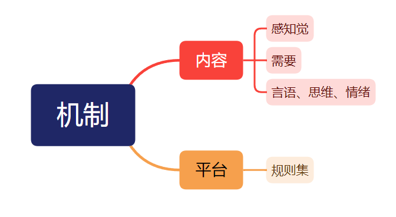
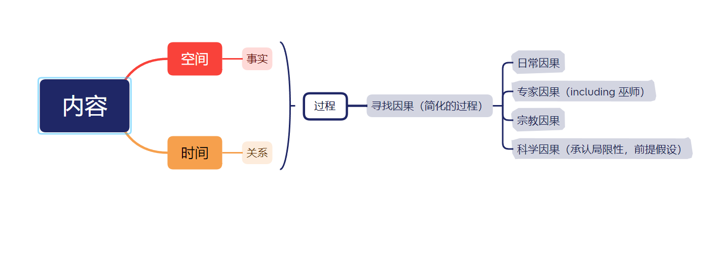

### 第一周-周二
* “心”是一个功能集，是一些功能的充分条件
* 研究“知道”这件事也是在“知道”的范畴之内。“我思故我在”

### 第一周-周四
* 心理与行为的交互作用
* 行为与生理的交互作用
  * 生理：神经的结构；体液的结构；etc
* 仿真的东西
  * 内容（意识）
  * 平台（生理）

* 检验仿真算法：逆运算造出数据，看拟合度
* 内容可以搭建在不同的平台上，平台某些结构的缺失会导致内容的缺失
* 相似的思想（正常的思想）可以在不同的生理结构上运作，生理上的缺失会导致思想的缺失
* 经验主义
* 计算规则/计算能力

### 第二周-周二
* 自由意志
  * 内容：子集/全集。越是全知，越是失去自由。自由在人文主义上仍然存在
  * 行为：从行为上考虑，自由||意志都是概率论的范围

* “意识是什么”这个问题是无聊的。即使我们能造出有意识的“人”，我们也不知道意识是什么。我们只能用“知道我们知道”这件事去近似描述“知道”这件事。但是说不清
* “人会死”是一个观念

* 前提：所有的内容都是意识的范畴
* 空间：有了两个及以上的元素
* 时间：时间由空间派生出来。两个元素之间的关系如果是单一的，变化的方式是确定的。两个元素的关系超过一种时，关系的变化遵守的秩序是时间
* 时间关系
  * 相继关系：两种具有相关关系的现象之间如果同时还具有时间序列上的前后相继关系
  * 即时关系：师生关系（有老师才有学生）
* *实质是“简化”*
